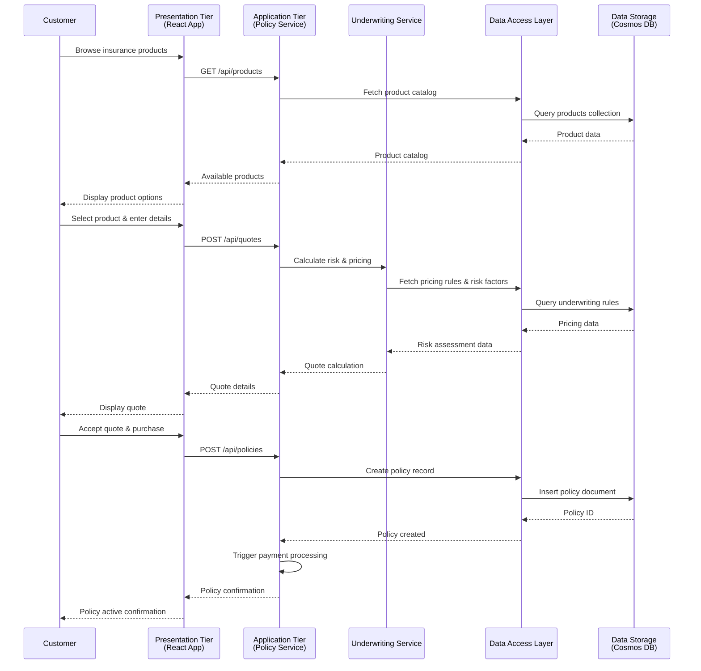
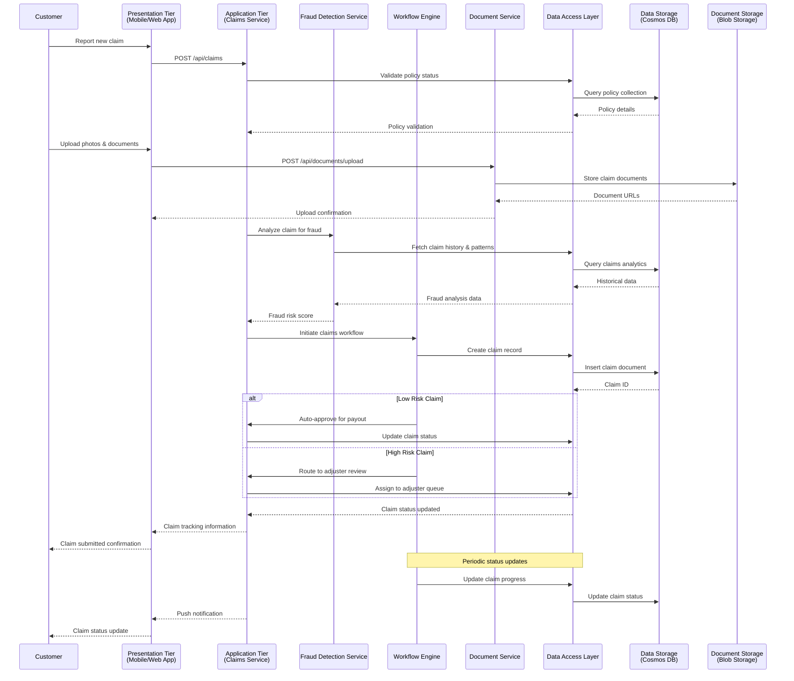

# Architecture Design

## Overview

Blue Square Insurance implements a modern 4-tier architecture to ensure scalability, maintainability, and security across our insurance platform. This architecture separates concerns and enables independent scaling and deployment of different system components.

```
                    BLUE SQUARE INSURANCE - 4-TIER ARCHITECTURE
    ═══════════════════════════════════════════════════════════════════════════════════════

    ┌─────────────────────────── TIER 1: PRESENTATION LAYER ───────────────────────────┐
    │                                                                                  │
    │  ┌──────────────┐  ┌──────────────┐  ┌──────────────┐  ┌──────────────┐          │
    │  │   Customer   │  │    Agent     │  │    Admin     │  │   Mobile     │          │
    │  │   Portal     │  │  Dashboard   │  │   Console    │  │    Apps      │          │
    │  │   (React)    │  │   (React)    │  │   (React)    │  │ (iOS/Android)│          │
    │  └──────┬───────┘  └──────┬───────┘  └──────┬───────┘  └──────┬───────┘          │
    │         │                 │                 │                 │                  │
    └─────────┼─────────────────┼─────────────────┼─────────────────┼────────────────-─┘
              │                 │                 │                 │
              ▼                 ▼                 ▼                 ▼
    ┌─────────────────────── TIER 2: APPLICATION/BUSINESS LOGIC ───────────────────────┐
    │                                                                                  |
    │  ┌──────────────┐  ┌──────────────┐  ┌──────────────┐  ┌──────────────┐          │
    │  │   Policy     │  │   Claims     │  │  Customer    │  │ Underwriting │          │
    │  │ Management   │  │ Processing   │  │ Management   │  │   Service    │          │
    │  │  Service     │  │   Service    │  │   Service    │  │              │          │
    │  └──────┬───────┘  └──────┬───────┘  └──────┬───────┘  └──────┬───────┘          │
    │         │                 │                 │                 │                  │
    │  ┌──────────────┐  ┌──────────────┐  ┌──────────────┐  ┌──────────────┐          │
    │  │   Payment    │  │    Fraud     │  │ Notification  │  │ Integration  │          │
    │  │ Processing   │  │  Detection   │  │   Service    │  │   Service    │          │
    │  │   Service    │  │   Service    │  │              │  │              │          │
    │  └──────┬───────┘  └──────┬───────┘  └──────┬───────┘  └──────┬───────┘          │
    │         │                 │                 │                 │                  │
    └─────────┼─────────────────┼─────────────────┼─────────────────┼─────────────────-┘
              │                 │                 │                 │
              ▼                 ▼                 ▼                 ▼
    ┌─────────────────────────── TIER 3: DATA ACCESS LAYER ───────────────────────────┐
    │                                                                                 │
    │  ┌──────────────┐  ┌──────────────┐  ┌──────────────┐  ┌──────────────┐         │
    │  │   Policy     │  │   Claims     │  │  Customer    │  │  Financial   │         │
    │  │ Data Access  │  │ Data Access  │  │ Data Access  │  │ Data Access  │         │
    │  │              │  │              │  │              │  │              │         │
    │  └──────┬───────┘  └──────┬───────┘  └──────┬───────┘  └──────┬───────┘         │
    │         │                 │                 │                 │                 │
    │  ┌──────────────┐  ┌──────────────┐         │                 │                 │
    │  │    Audit     │  │    Cache     │         │                 │                 │
    │  │ Data Access  │  │ Management   │         │                 │                 │
    │  │              │  │   (Redis)    │         │                 │                 │
    │  └──────┬───────┘  └──────┬───────┘         │                 │                 │
    │         │                 │                 │                 │                 │
    └─────────┼─────────────────┼─────────────────┼─────────────────┼─────────────────┘
              │                 │                 │                 │
              ▼                 ▼                 ▼                 ▼
    ┌─────────────────────────── TIER 4: DATA STORAGE LAYER ──────────────────────────┐
    │                                                                                 │
    │  ┌──────────────────────────────┐      ┌──────────────────────────────┐         │
    │  │      Azure Cosmos DB         │      │      Azure Blob Storage      │         │
    │  │   (Primary NoSQL Database)   │      │    (Documents & Media)       │         │
    │  │                              │      │                              │         │
    │  │  • Customer Profiles          │      │  • Policy Documents          │         │
    │  │  • Insurance Policies        │      │  • Claim Photos              │         │
    │  │  • Claims Records            │      │  • Legal Documents           │         │
    │  │  • Underwriting Data         │      │  • Archived Files            │         │
    │  └──────────────────────────────┘      └──────────────────────────────┘         │
    │                                                                                 │
    │  ┌──────────────────────────────┐      ┌──────────────────────────────┐         │
    │  │      Azure SQL Database      │      │    Analytics Warehouse       │         │
    │  │   (Financial & Accounting)   │      │  (Business Intelligence)     │         │
    │  │                              │      │                              │         │
    │  │  • Financial Transactions    │      │  • Reporting Data            │         │
    │  │  • Accounting Records        │      │  • Performance Metrics       │         │
    │  │  • Audit Logs                │      │  • Compliance Reports        │         │
    │  │  • Reconciliation Data       │      │  • Analytics Models          │         │
    │  └──────────────────────────────┘      └──────────────────────────────┘         │
    │                                                                                 │
    └───────────────────────────────────────────────────────────────────────────────-─┘


    SECURITY & COMPLIANCE                    MONITORING & OBSERVABILITY
    ═════════════════════                   ═══════════════════════════
    🔐 End-to-End Encryption               📊 Real-time Monitoring
    🛡️  Zero-Trust Architecture            📈 Performance Metrics
    🔑 Multi-Factor Authentication          🚨 Alerting & Notifications
    📋 SOC 2 Compliance                     📝 Distributed Tracing
    🏛️  Regulatory Adherence               🔍 Log Aggregation

    DEPLOYMENT & INFRASTRUCTURE             INTEGRATION & APIS
    ═══════════════════════════             ══════════════════
    ☁️  Azure Cloud Platform                🔗 RESTful APIs
    📦 Kubernetes Orchestration            🔄 Event-Driven Architecture
    🔄 CI/CD Pipelines                      📡 Real-time WebSockets
    🌍 Multi-Region Deployment             🤖 AI/ML Services Integration
    ⚖️  Auto-scaling & Load Balancing      📊 Third-party Data Feeds
```

## Architecture Tiers

### Tier 1: Presentation Layer

**Technology Stack:** React, TypeScript, Progressive Web App (PWA)

The presentation layer handles all user interactions and provides the interface for customers, agents, and administrators.

**Components:**

- **Customer Portal** - Policy management, claims submission, account management
- **Agent Dashboard** - Customer management, policy sales, claims assistance
- **Admin Console** - System administration, reporting, configuration
- **Mobile Applications** - iOS and Android native apps for customers
- **Public Website** - Marketing pages, quote tools, customer acquisition

**Responsibilities:**

- User interface rendering and interaction
- Form validation and user input handling
- Authentication token management
- Real-time notifications and updates
- Responsive design across devices

### Tier 2: Application/Business Logic Layer

**Technology Stack:** Node.js, Express.js/Fastify, TypeScript

The application layer implements core business logic and orchestrates operations across different services.

**Components:**

- **Policy Management Service** - Policy creation, modification, renewal logic
- **Claims Processing Service** - Claims workflow, assessment, approval logic
- **Customer Management Service** - Customer profiles, communications, preferences
- **Underwriting Service** - Risk assessment, pricing calculations, approval workflows
- **Payment Processing Service** - Premium collection, claim payouts, billing
- **Fraud Detection Service** - AI-powered fraud analysis and reporting
- **Notification Service** - Email, SMS, and push notification management
- **Integration Service** - Third-party API integrations (credit bureaus, external data)

**Responsibilities:**

- Business rule enforcement
- Workflow orchestration
- Service coordination and data aggregation
- Authentication and authorization
- API rate limiting and security
- Business event processing

### Tier 3: Data Access Layer

**Technology Stack:** ORM/ODM (Prisma/Mongoose), Redis for caching

The data access layer provides abstraction between business logic and data storage, ensuring consistent data operations.

**Components:**

- **Policy Data Access Layer** - Policy CRUD operations, policy history
- **Claims Data Access Layer** - Claims data management, document handling
- **Customer Data Access Layer** - Customer profiles, relationship management
- **Financial Data Access Layer** - Transactions, accounting, reconciliation
- **Audit Data Access Layer** - Activity logging, compliance tracking
- **Cache Management** - Redis-based caching for frequently accessed data
- **Search Service** - Elasticsearch for complex queries and analytics

**Responsibilities:**

- Data validation and sanitization
- Query optimization and caching
- Data transformation and mapping
- Transaction management
- Database connection pooling
- Data encryption at rest

### Tier 4: Data Storage Layer

**Technology Stack:** Azure Cosmos DB (primary), Azure Blob Storage, Azure SQL Database

The storage layer provides persistent data storage with high availability and disaster recovery capabilities.

**Components:**

- **Primary Database (Cosmos DB)** - Customer data, policies, claims (NoSQL for scale)
- **Financial Database (SQL)** - Accounting, transactions, financial reporting (ACID compliance)
- **Document Storage (Blob)** - Policy documents, claim photos, legal documents
- **Analytics Warehouse** - Data warehouse for reporting and business intelligence
- **Backup Systems** - Automated backups, point-in-time recovery
- **Archive Storage** - Long-term retention for compliance and historical data

**Responsibilities:**

- Data persistence and integrity
- Backup and disaster recovery
- Data archival and compliance
- Performance optimization
- Security and encryption

## Data Flow Diagrams

### Online Policy Selection Flow



### Claims Process Flow



## Security Considerations

### Tier-Level Security

- **Presentation Tier**: HTTPS/TLS, CSP headers, input sanitization
- **Application Tier**: JWT authentication, API rate limiting, service-to-service authentication
- **Data Access Tier**: Connection encryption, parameterized queries, access controls
- **Storage Tier**: Encryption at rest, network isolation, backup encryption

### Cross-Tier Security

- Zero-trust architecture with authentication at every tier
- End-to-end encryption for sensitive data (PII, financial information)
- Audit logging across all tiers for compliance tracking
- Regular security assessments and penetration testing

## Performance Considerations

### Scalability Patterns

- **Horizontal Scaling**: Application tier services are stateless and can scale independently
- **Caching Strategy**: Multi-level caching (CDN, application cache, database cache)
- **Database Optimization**: Cosmos DB partitioning strategy for optimal performance
- **Load Balancing**: Application load balancers with health checks

### Monitoring & Observability

- Application Performance Monitoring (APM) across all tiers
- Distributed tracing for request flow analysis
- Real-time metrics and alerting
- Performance budgets and SLA monitoring

## Deployment Architecture

### Container Strategy

- Each application tier service is containerized
- Kubernetes orchestration for container management
- Blue-green deployments for zero-downtime updates

### Infrastructure

- Azure-hosted infrastructure with multi-region deployment
- Infrastructure as Code (IaC) using Terraform/ARM templates
- Automated CI/CD pipelines for each tier

## Related Documents

- [ADR-001: Adopt React for Frontend Development](../adr/001-adopt-react-frontend.md)
- [Security Architecture](security-architecture.md) _(to be created)_
- [API Design Guidelines](api-design-guidelines.md) _(to be created)_
- [Database Design](database-design.md) _(to be created)_

---

_Version: 1.0_  
_Last Updated: 2026-02-07_  
_Authors: Architecture Team_  
_Reviewers: Engineering Leadership, Security Team_
